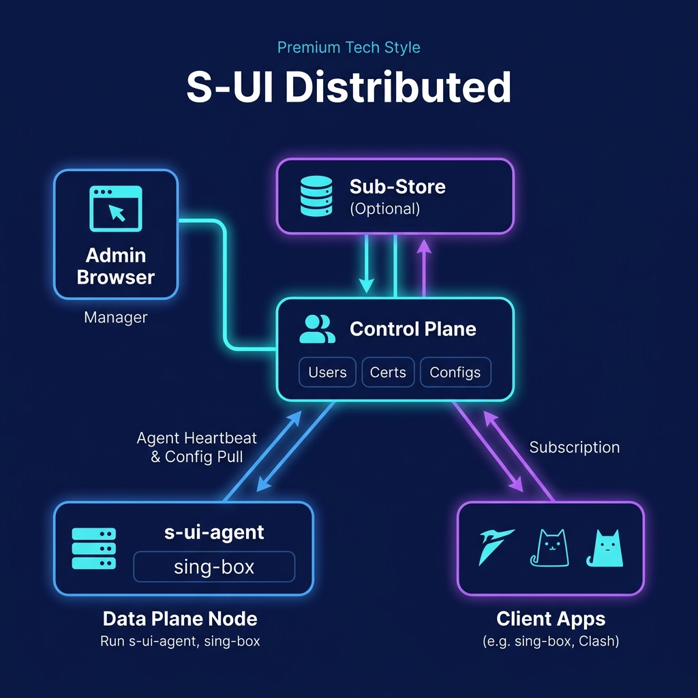

# S-UI Distributed Preview

S-UI Distributed 是基于 [alireza0/s-ui](https://github.com/alireza0/s-ui) 重构的 Sing-box 分布式管理面板实验版本。它的目标不是只管理本机 sing-box，而是把一台服务器作为 Control Plane，把多台远端 VPS 作为 Data Plane，通过 Agent 自动同步配置、证书和节点状态。

> 免责声明：本项目仅供个人学习与技术交流使用，请勿用于非法用途。当前版本是 Preview，不是稳定生产版。

## 📖 目录

- [当前版本](#当前版本)
- [系统架构](#架构)
- [目录说明](#目录说明)
- [部署前准备](#部署前准备)
- [快速本地启动](#快速本地启动)
- [服务端部署 (Control Plane)](#服务端部署)
  - [方式一：实体机一键脚本](#方式一实体机一键脚本)
  - [方式二：Docker 一键脚本](#方式二docker-一键脚本)
  - [方式三：Docker Compose 部署](#方式三docker-compose)
  - [方式四：旧服务端脚本说明](#方式四旧服务端脚本说明)
- [Agent 部署 (Data Plane Node)](#agent-部署)
  - [方式一：Systemd 实体机一键脚本](#方式一systemd-实体机一键脚本)
  - [方式二：Docker Compose 容器部署 (双容器 Sidecar 模式)](#方式二docker-compose-容器部署-双容器-sidecar-模式)
  - [方式三：Podman / Podman Compose 容器部署 (双容器 Sidecar 模式)](#方式三podman--podman-compose-容器部署-双容器-sidecar-模式)
- [系统使用流程](#使用流程)
  - [1. 登录面板](#1-登录面板)
  - [2. 创建节点](#2-创建节点)
  - [3. 配置 DNS Provider](#3-配置-dns-provider)
  - [4. 申请证书](#4-申请证书)
  - [5. 创建服务入口](#5-创建服务入口)
  - [6. 配置全局默认策略](#6-配置全局默认策略)
  - [7. 绑定用户](#7-绑定用户)
  - [8. 发布配置](#8-发布配置)
  - [9. 获取订阅](#9-获取订阅)
- [证书和密钥安全](#证书和密钥安全)
- [Sub-Store 集成](#sub-store-集成)
- [本地测试](#本地测试)
- [发布前检查](#发布前检查)
- [常见问题](#常见问题)
- [文档索引](#文档索引)

## 当前版本

目标版本：`v0.2.0-preview.1`

这个版本主要验证下面这条主链路：

```text
Control Plane 面板 -> 远端 Agent -> sing-box 配置文件 -> 客户端订阅
```

已包含：

- PostgreSQL 开发环境
- 集群节点管理
- Agent 注册、心跳、配置拉取和基础状态上报
- DNS Provider 管理
- 证书中心
- 多协议服务入口
- 入口级 JSON 策略覆盖
- 全局默认配置预览
- 配置版本生成与发布
- 用户绑定与分布式订阅
- 证书 PEM、证书私钥和 DNS Provider 凭据字段级加密

仍处于 Preview：

- 真实服务器端到端联调仍需要继续验证
- Control Plane 外部探测仍未完成
- Docker 多架构镜像发布流程仍需完善
- 证书签发和续签需要真实 DNS Provider 验证
- Agent 资源监控、失败回滚、日志摘要仍是后续增强项

详细状态见 [docs/PREVIEW_0_1.md](docs/PREVIEW_0_1.md)。

## 架构


Control Plane 负责：

- 管理用户、节点、证书、服务入口和配置版本
- 生成 sing-box 配置
- 生成订阅
- 接收 Agent 心跳
- 下发证书和配置

Data Plane 负责：

- 运行 `s-ui-agent`
- 运行 `sing-box`
- 主动向 Control Plane 注册和心跳
- 拉取配置、写入证书、校验并应用配置
- 上报 sing-box 状态、版本和当前配置版本

## 目录说明

```text
backend/                 Go 后端、API、订阅、Agent
frontend/                Vue 前端
scripts/install-agent.sh Agent systemd 安装脚本
docker-compose.dev.yml   本地开发 compose，包含 PostgreSQL
docker-compose.yml       服务器部署 compose 示例
docs/                    设计、开发、测试和 Preview 文档
```

## 部署前准备

服务端建议：

- Linux x86_64 VPS
- 2 核 CPU / 2GB 内存以上，推荐 4GB 内存
- 已解析到面板服务器的域名
- 如果要签发证书，需要可用 DNS Provider API Token

服务端部署有两条主路径：

- 实体机部署：不使用 Docker，安装到 `/usr/local/s-ui`，由 systemd 管理，默认使用 SQLite。
- Docker 部署：使用 Docker Compose，安装到 `/opt/s-ui-distributed`，默认使用 PostgreSQL 容器。

如果选择 Docker 部署，需要提前安装 Docker 24+ 和 Docker Compose v2。

节点端建议：

- Linux x86_64 VPS
- systemd
- sing-box 已安装，或后续由你的部署脚本安装
- 能访问 Control Plane 的 Agent API
- 节点域名已经解析到节点公网 IP

端口：

- `2095`：面板 Web UI 默认端口，安装脚本可交互修改
- `2096`：订阅服务默认端口，安装脚本可交互修改
- `443` 或自定义端口：节点上的代理协议入口
- `10080`：节点本地 `sing-box` 的 `v2ray_api` 统计监听端口（仅监听在 `127.0.0.1`，用于本地 Agent 收集流量数据，**请勿对外开放**）
- Agent 默认不需要公网入站端口，它主动连接 Control Plane

安全变量：

- `SUI_SECRET_KEY`：用于加密 DNS Provider 凭据、证书 PEM 和证书私钥。生产必须设置，建议 32 字符以上，并妥善备份。
- `SUI_AGENT_REGISTER_TOKEN`：Agent 注册令牌。控制端和 Agent 安装参数必须一致。

## 快速本地启动

本地开发推荐使用 `docker-compose.dev.yml`，它会启动 PostgreSQL 和 Control Plane。

```sh
docker compose -f docker-compose.dev.yml up -d --build s-ui
```

访问：

```text
http://localhost:2095/app/
```

订阅服务：

```text
http://localhost:2096/sub/
```

停止：

```sh
docker compose -f docker-compose.dev.yml down
```

清理本地开发数据库：

```sh
docker compose -f docker-compose.dev.yml down -v
```

如果 Docker 构建卡在基础镜像 metadata、Go/NPM registry 或 acme.sh 下载，通常是网络问题。可以稍后重试，或先使用本地测试命令验证代码。

## 服务端部署

### 方式一：实体机一键脚本

如果你不想在服务器上使用 Docker，可以用实体机脚本。它会下载 GitHub Release 中的 `s-ui-linux-当前架构.tar.gz`，安装到 `/usr/local/s-ui`，并创建 `s-ui.service`。

在服务器上执行：

```sh
bash <(curl -fsSL https://raw.githubusercontent.com/sellength/S-UI_rebuild/review/scripts/install-control-native.sh)
```

脚本会进入交互向导，让你确认：

- 面板 Web UI 端口，默认 `2095`
- 订阅服务端口，默认 `2096`
- 面板公网访问地址，例如 `https://panel.example.com` 或 `http://服务器IP:2095`

默认安装到：

```text
/usr/local/s-ui
```

默认使用 SQLite：

```text
/usr/local/s-ui/db
```

脚本会自动完成：

- 下载并解压 S-UI Release 包
- 安装 acme.sh 到 `/usr/local/s-ui/acme`
- 自动生成 `SUI_SECRET_KEY`
- 自动生成 `SUI_AGENT_REGISTER_TOKEN`
- 写入 `/usr/local/s-ui/s-ui.env`
- 初始化数据库
- 写入面板端口和订阅端口
- 创建并启动 `s-ui.service`

如果你还没有发布 GitHub Release，可以先手动上传 `s-ui-linux-amd64.tar.gz`，然后指定下载地址：

```sh
bash <(curl -fsSL https://raw.githubusercontent.com/sellength/S-UI_rebuild/review/scripts/install-control-native.sh) \
  --package-url https://example.com/s-ui-linux-amd64.tar.gz
```

如果你想无人值守安装：

```sh
bash <(curl -fsSL https://raw.githubusercontent.com/sellength/S-UI_rebuild/review/scripts/install-control-native.sh) \
  --non-interactive \
  --panel-port 2095 \
  --sub-port 2096 \
  --panel-url https://panel.example.com
```

如果你要使用外部 PostgreSQL，而不是默认 SQLite：

```sh
bash <(curl -fsSL https://raw.githubusercontent.com/sellength/S-UI_rebuild/review/scripts/install-control-native.sh) \
  --postgres-dsn 'host=127.0.0.1 user=sui password=your-password dbname=sui port=5432 sslmode=disable'
```

安装后查看：

```sh
systemctl status s-ui
journalctl -u s-ui -f
```

卸载但保留数据：

```sh
bash <(curl -fsSL https://raw.githubusercontent.com/sellength/S-UI_rebuild/review/scripts/uninstall-control-native.sh)
```

卸载并删除数据：

```sh
bash <(curl -fsSL https://raw.githubusercontent.com/sellength/S-UI_rebuild/review/scripts/uninstall-control-native.sh) --purge
```

需要备份：

```text
/usr/local/s-ui/db
/usr/local/s-ui/cert
/usr/local/s-ui/certificates
/usr/local/s-ui/acme
/usr/local/s-ui/s-ui.env
```

其中 `s-ui.env` 里的 `SUI_SECRET_KEY` 必须备份。丢失后，已保存的 DNS API 凭据和证书私钥无法解密。

### 方式二：Docker 一键脚本

在服务器上执行：

```sh
bash <(curl -fsSL https://raw.githubusercontent.com/sellength/S-UI_rebuild/review/scripts/install-control.sh)
```

这个脚本是 Docker Compose 部署，不是实体机部署。它会拉取 Docker Hub 镜像：

```text
sellength/s-ui_dev:latest
postgres:17-alpine
```

如果看到 `sellength/s-ui_dev:latest: not found`，说明 Docker Hub 镜像还没有由 GitHub Actions 构建并推送。解决方式有两个：

- 先在 GitHub Actions 中触发 Docker Image CI，把镜像推送到 Docker Hub。
- 改用上面的实体机一键脚本，不依赖 Docker 镜像。

脚本会进入交互向导，让你确认：

- 面板 Web UI 端口，默认 `2095`
- 订阅服务端口，默认 `2096`
- PostgreSQL 本机端口，默认 `54329`，只绑定 `127.0.0.1`
- 面板公网访问地址，例如 `https://panel.example.com` 或 `http://服务器IP:2095`

默认安装到：

```text
/opt/s-ui-distributed
```

脚本会自动完成：

- 检查 Docker 和 Docker Compose
- 下载 `docker-compose.yml`
- 下载 `.env.example` 并生成 `.env`
- 自动生成 `SUI_POSTGRES_PASSWORD`
- 自动生成 `SUI_SECRET_KEY`
- 自动生成 `SUI_AGENT_REGISTER_TOKEN`
- 写入面板端口和订阅端口
- 创建持久化目录
- 启动 Control Plane

如果你要无人值守安装，可以用参数跳过交互：

```sh
bash <(curl -fsSL https://raw.githubusercontent.com/sellength/S-UI_rebuild/review/scripts/install-control.sh) \
  --non-interactive \
  --panel-port 2095 \
  --sub-port 2096 \
  --postgres-port 54329 \
  --panel-url https://panel.example.com
```

也可以通过环境变量指定：

```sh
SUI_PANEL_PORT=2095 \
SUI_SUB_PORT=2096 \
SUI_POSTGRES_PORT=54329 \
SUI_PANEL_DOMAIN=https://panel.example.com \
bash <(curl -fsSL https://raw.githubusercontent.com/sellength/S-UI_rebuild/review/scripts/install-control.sh) --non-interactive
```

安装后查看：

```sh
cd /opt/s-ui-distributed
docker compose --env-file .env ps
docker compose --env-file .env logs -f s-ui
```

卸载但保留数据：

```sh
bash <(curl -fsSL https://raw.githubusercontent.com/sellength/S-UI_rebuild/review/scripts/uninstall-control.sh)
```

卸载并删除数据：

```sh
bash <(curl -fsSL https://raw.githubusercontent.com/sellength/S-UI_rebuild/review/scripts/uninstall-control.sh) --purge
```

如果你的系统默认没有 `bash`，可以先安装 `bash`，或下载脚本后用 `sh` 执行。

### 方式三：Docker Compose

当前 Preview 推荐用 Docker Compose 部署 Control Plane。服务器上准备目录：

```sh
mkdir -p /opt/s-ui-distributed
cd /opt/s-ui-distributed
```

下载或复制仓库中的：

```text
docker-compose.yml
.env.example
```

创建生产环境变量：

```sh
cp .env.example .env
```

编辑 `.env`：

```text
TZ=Asia/Shanghai
SUI_POSTGRES_PORT=54329
SUI_PANEL_PORT=2095
SUI_SUB_PORT=2096
SUI_POSTGRES_PASSWORD=replace-with-a-long-random-postgres-password
SUI_SECRET_KEY=replace-with-a-long-random-secret-at-least-32-chars
SUI_AGENT_REGISTER_TOKEN=replace-with-a-long-random-agent-register-token
SUI_PANEL_DOMAIN=https://panel.example.com
```

启动：

```sh
docker compose --env-file .env up -d
```

查看状态：

```sh
docker compose ps
docker compose logs -f s-ui
```

访问：

```text
http://你的服务器IP:你的面板端口/app/
```

如果你放在反向代理后面，建议使用 HTTPS，并把面板域名配置成：

```text
https://panel.example.com
```

停止：

```sh
docker compose down
```

升级：

```sh
docker compose pull
docker compose up -d
```

备份至少包含：

```text
./db
./cert
./certificates
./acme
.env
```

其中 `.env` 里的 `SUI_SECRET_KEY` 必须备份。丢失后，已保存的 DNS API 凭据和证书私钥无法解密。`./db` 是 PostgreSQL 数据目录，备份和迁移时不要只复制单个数据库文件。

### 方式四：旧服务端脚本说明

仓库根目录保留了原 S-UI 的 `install.sh`、`s-ui.sh`、`docker-run.sh` 等脚本，但它们主要面向旧的单机 S-UI 流程，不建议作为分布式 Preview 的服务器安装入口。

当前 Preview 的服务端主路径是：

- 实体机：`scripts/install-control-native.sh`
- Docker：`scripts/install-control.sh` 或手动 Docker Compose

## Agent 部署

Agent 安装在每台远端节点上。它主动连接 Control Plane，不需要在节点上额外开放 Agent 入站端口。目前支持 Systemd 实体机一键部署 和 Docker 容器化部署 两种模式。

### 方式一：Systemd 实体机一键脚本

节点上执行：

```sh
bash <(curl -fsSL https://raw.githubusercontent.com/sellength/S-UI_rebuild/review/scripts/install-agent.sh) \
  --panel-agent-url https://panel.example.com/app/agent \
  --node-code us-01 \
  --agent-id agent-us-01 \
  --agent-token 'replace-with-node-agent-token' \
  --register-token 'same-as-SUI_AGENT_REGISTER_TOKEN' \
  --interval 30s \
  --reload-command 'systemctl restart sing-box'
```

> [!TIP]
> **如何获取 `SUI_AGENT_REGISTER_TOKEN`（平台注册 Token）：**
> * **Docker 部署**：在主控端服务器的 `/opt/s-ui-distributed/.env` 文件的 `SUI_AGENT_REGISTER_TOKEN` 选项中复制。
> * **实体机部署**：在主控端服务器的 `/usr/local/s-ui/s-ui.env` 文件的 `SUI_AGENT_REGISTER_TOKEN` 选项中复制。

脚本会自动完成：

- 下载或复用 `/usr/local/s-ui-agent/s-ui-agent`
- 写入 `/usr/local/s-ui-agent/agent.env`
- 创建配置、证书和日志目录
- 创建并启动 `s-ui-agent.service`

默认下载地址是 GitHub 最新 Release：

```text
https://github.com/sellength/S-UI_rebuild/releases/latest/download/s-ui-agent-linux-amd64
```

如果你还没有发布 Release，可以先手动上传二进制，或指定下载地址：

```sh
bash <(curl -fsSL https://raw.githubusercontent.com/sellength/S-UI_rebuild/review/scripts/install-agent.sh) \
  --agent-download-url https://example.com/s-ui-agent-linux-amd64 \
  --panel-agent-url https://panel.example.com/app/agent \
  --node-code us-01 \
  --agent-id agent-us-01 \
  --agent-token 'replace-with-node-agent-token' \
  --register-token 'same-as-SUI_AGENT_REGISTER_TOKEN'
```

卸载 Agent：

```sh
bash <(curl -fsSL https://raw.githubusercontent.com/sellength/S-UI_rebuild/review/scripts/uninstall-agent.sh)
```

卸载但保留 Agent 数据：

```sh
bash <(curl -fsSL https://raw.githubusercontent.com/sellength/S-UI_rebuild/review/scripts/uninstall-agent.sh) --keep-data
```

### 2. 手动构建 Linux x86_64 Agent

在开发机或 CI 上构建：

```sh
cd backend
GOOS=linux GOARCH=amd64 go build -o /private/tmp/s-ui-agent-linux-amd64 ./agent
```

如果已经有发布产物，可以直接下载对应平台的 `s-ui-agent`。

### 3. 上传到节点

把二进制上传到节点：

```text
/usr/local/s-ui-agent/s-ui-agent
```

并设置可执行权限：

```sh
sudo mkdir -p /usr/local/s-ui-agent
sudo cp s-ui-agent-linux-amd64 /usr/local/s-ui-agent/s-ui-agent
sudo chmod +x /usr/local/s-ui-agent/s-ui-agent
```

### 4. 用脚本安装 systemd 服务

如果你不想用 `curl | bash`，也可以把仓库中的 `scripts/install-agent.sh` 上传到节点，然后执行：

```sh
sudo sh scripts/install-agent.sh \
  --panel-agent-url https://panel.example.com/app/agent \
  --node-code us-01 \
  --agent-id agent-us-01 \
  --agent-token 'replace-with-node-agent-token' \
  --register-token 'same-as-SUI_AGENT_REGISTER_TOKEN' \
  --interval 30s \
  --reload-command 'systemctl restart sing-box'
```

参数说明：

- `--panel-agent-url`：Control Plane 的 Agent API 地址，通常是 `https://面板域名/app/agent`
- `--node-code`：面板里创建的节点代号，例如 `us-01`
- `--agent-id`：当前 Agent 的唯一 ID，例如 `agent-us-01`
- `--agent-token`：当前节点自己的 Agent Token
- `--register-token`：控制端的 `SUI_AGENT_REGISTER_TOKEN`
- `--interval`：心跳和配置检查间隔
- `--reload-command`：配置应用后执行的 reload/restart 命令

脚本会创建：

```text
/usr/local/s-ui-agent/agent.env
/usr/local/s-ui-agent/configs/
/usr/local/s-ui-agent/certs/
/usr/local/s-ui-agent/state.json
/etc/systemd/system/s-ui-agent.service
```

常用命令：

```sh
sudo systemctl status s-ui-agent
sudo journalctl -u s-ui-agent -f
sudo systemctl restart s-ui-agent
```

更多细节见 [docs/AGENT_RUNTIME.md](docs/AGENT_RUNTIME.md) 和 [docs/AGENT_API.md](docs/AGENT_API.md)。

### 方式二：Docker Compose 容器部署 (双容器 Sidecar 模式)

当您的节点（Data Plane）环境完全基于 Docker 时，推荐使用双容器 Sidecar 模式进行部署。

在该模式下：
1. `s-ui-agent` 容器负责主动与控制端（Control Plane）进行心跳和配置同步，将最新配置和证书拉取到本地共享卷中。
2. `sing-box` 容器负责挂载并读取该共享配置运行。
3. `s-ui-agent` 容器通过挂载主机的 `/var/run/docker.sock`，可以在配置更新后通过 `docker restart sing-box` 命令来重启旁边的 `sing-box` 容器。

#### 1. 创建部署目录
在节点服务器上执行：
```sh
mkdir -p /opt/s-ui-agent
cd /opt/s-ui-agent
mkdir -p configs certs
```

#### 2. 获取 `docker-compose.yml`
您可以通过 `curl` 直接从 GitHub 仓库下载预配置好的 `docker-compose.agent.yml` 模版：
```sh
curl -fsSL https://raw.githubusercontent.com/sellength/S-UI_rebuild/review/docker-compose.agent.yml -o docker-compose.yml
```
或者手动在 `/opt/s-ui-agent` 目录下创建并编写 `docker-compose.yml`：
```yaml
services:
  s-ui-agent:
    image: sellength/s-ui_agent:latest
    container_name: s-ui-agent
    restart: always
    network_mode: host
    environment:
      - SUI_AGENT_BASE_URL=https://panel.example.com/app/agent  # 控制端 Agent API 地址
      - SUI_NODE_CODE=us-01                                     # 节点代号
      - SUI_AGENT_ID=agent-us-01                               # 节点 Agent 唯一 ID
      - SUI_AGENT_TOKEN=replace-with-node-agent-token           # 节点专属 Token
      - SUI_AGENT_REGISTER_TOKEN=same-as-SUI_AGENT_REGISTER_TOKEN # 控制端注册 Token
      - SUI_AGENT_INTERVAL=30s                                  # 同步时间间隔
      - SUI_AGENT_RELOAD_COMMAND=docker restart sing-box        # 配置更新后的重启命令
      - SUI_AGENT_CHECK_CONFIG=false                            # 容器部署时 Agent 内部无 sing-box，需设为 false 避免校验报错
      - SUI_AGENT_STATE_PATH=/usr/local/s-ui-agent/configs/state.json # 将状态文件存在共享目录下，避免单独挂载文件被误建为目录
    volumes:
      - /var/run/docker.sock:/var/run/docker.sock               # 允许控制宿主机 Docker 重启 sing-box
      - ./configs:/usr/local/s-ui-agent/configs
      - ./certs:/usr/local/s-ui-agent/certs

  sing-box:
    image: sellength/s-ui_rebuild-singbox:latest
    container_name: sing-box
    restart: always
    network_mode: host
    volumes:
      - ./configs:/app/configs                                  # 挂载共享配置目录，sing-box 启动脚本会自动链接 config.json
      - ./certs:/usr/local/s-ui-agent/certs
```

#### 3. 快速替换与配置环境变量
为了提高部署效率，您可以使用以下 `sed` 快捷命令在终端一键修改 `docker-compose.yml` 中的环境变量，而无需使用文本编辑器：

##### A. 一键生成并替换专属的 `SUI_AGENT_TOKEN`
```sh
sed -i "s/replace-with-node-agent-token/$(openssl rand -hex 16)/g" docker-compose.yml
```

##### B. 一键修改控制端地址、节点代号和控制端注册 Token
```sh
# 请根据实际情况，将下面命令里的 URL、节点代号、配对 Token 替换后直接运行：
sed -i "s|https://panel.example.com/app/agent|http://你的控制端服务器公网IP:2095/app/agent|g" docker-compose.yml
sed -i "s/us-01/您的节点代号/g" docker-compose.yml
sed -i "s/same-as-SUI_AGENT_REGISTER_TOKEN/控制端的SUI_AGENT_REGISTER_TOKEN值/g" docker-compose.yml
```

#### 4. 启动节点服务
```sh
docker compose up -d
```

#### 4. 常用运维命令
```sh
# 升级节点镜像并应用
docker compose pull && docker compose up -d

# 查看 Agent 心跳和日志
docker compose logs -f s-ui-agent

# 查看 sing-box 运行日志
docker compose logs -f sing-box
```

### 方式三：Podman / Podman Compose 容器部署 (双容器 Sidecar 模式)

在某些默认自带 Podman 或需要无根容器环境的系统（如 Rocky Linux / CentOS 8+ / RHEL / Ubuntu）中，您无需安装 Docker，可以直接利用 Podman 部署 Agent。

#### 1. 安装 Podman 及 Compose 支持

根据您的操作系统，执行以下命令安装：

##### CentOS / RHEL / Rocky Linux
```sh
# 安装 podman 核心程序及 docker 兼容命令行
sudo dnf install -y podman podman-docker

# 方式 A：使用 podman-compose 运行（纯 Podman 生态）
sudo dnf install -y podman-compose

# 方式 B：使用官方 docker-compose（推荐，通过 API 适配器，即用户遇到的情况）
sudo dnf install -y docker-compose-plugin
```

##### Ubuntu / Debian
```sh
sudo apt-get update
# 安装 podman
sudo apt-get install -y podman

# 方式 A：安装 podman-compose
sudo apt-get install -y podman-compose

# 方式 B：安装 docker-compose
sudo apt-get install -y docker-compose
```

#### 2. 开启 Podman Socket 服务与 Docker 兼容链接
由于 Podman 默认无常驻守护进程，如果要使用 Docker Compose 或由 Agent 容器控制其它容器，必须在节点上开启 API Socket 服务，并建立 `/var/run/docker.sock` 软链接打通兼容通道：
```sh
# 开启并开机启动 Podman Socket
sudo systemctl enable --now podman.socket

# 清理宿主机残留的 docker.sock 并创建指向 Podman Socket 的软链接
sudo rm -rf /var/run/docker.sock
sudo ln -s /run/podman/podman.sock /var/run/docker.sock
```

#### 2. 创建部署目录并获取 `docker-compose.yml`
```sh
mkdir -p /opt/s-ui-agent
cd /opt/s-ui-agent
mkdir -p configs certs
curl -fsSL https://raw.githubusercontent.com/sellength/S-UI_rebuild/review/docker-compose.agent.yml -o docker-compose.yml
```

#### 3. 快速配置环境变量
使用 `sed` 快捷命令在终端一键配置：
```sh
# 一键生成专属 SUI_AGENT_TOKEN
sed -i "s/replace-with-node-agent-token/$(openssl rand -hex 16)/g" docker-compose.yml

# 替换控制端 API 地址、代号及配对注册 Token
sed -i "s|https://panel.example.com/app/agent|http://你的控制端服务器公网IP:2095/app/agent|g" docker-compose.yml
sed -i "s/us-01/您的节点代号/g" docker-compose.yml
sed -i "s/same-as-SUI_AGENT_REGISTER_TOKEN/控制端的SUI_AGENT_REGISTER_TOKEN值/g" docker-compose.yml
```

#### 4. 启动与查看日志
根据您安装的 Compose 兼容插件，选择以下一种方式启动：

##### 方式 A：使用 podman-compose
```sh
# 启动容器
podman-compose up -d

# 查看 Agent 同步与心跳日志
podman-compose logs -f s-ui-agent
```

##### 方式 B：使用 docker-compose / docker compose
```sh
# 启动容器
docker compose up -d

# 查看 Agent 同步与心跳日志
docker compose logs -f s-ui-agent
```

## 使用流程

### 1. 登录面板

启动 Control Plane 后访问：

```text
http://你的服务器IP:2095/app/
```

首次使用建议立即修改管理员账号和密码。

### 2. 创建节点

进入“集群管理”，创建节点：

- 名称：例如 `us`
- 节点代号：例如 `us-01`
- 地区：例如 `US`
- 服务商：例如 `AWS`
- 公开域名：例如 `us.example.com`
- 公网 IP：节点真实公网 IP

节点代号要和 Agent 安装脚本中的 `--node-code` 保持一致。

### 3. 配置 DNS Provider

进入“集群管理 -> 证书中心”，添加 DNS Provider。

支持模板：

- Cloudflare：`CF_Token`
- AliDNS：`Ali_Key`、`Ali_Secret`
- AWS：`AWS_ACCESS_KEY_ID`、`AWS_SECRET_ACCESS_KEY`
- Tencent DNSPod：`DP_Id`、`DP_Key`

Cloudflare 推荐使用只包含 Zone DNS Edit 权限的 API Token。DNS API 只用于 Let's Encrypt DNS-01 TXT 验证，不要求开启 Cloudflare 小云朵代理。

### 4. 申请证书

在“证书中心”申请证书：

```text
*.example.com, example.com
us.example.com, sg.example.com
```

说明：

- 通配符由域名输入决定，填写 `*.example.com` 即表示申请通配符证书。
- 手动上传证书不负责自动续期，Preview 版本默认不作为主路径。
- AnyTLS、Hysteria2、Trojan、VLESS Reality 等入口可引用证书中心的证书资产。

### 5. 创建服务入口

进入“集群管理 -> 服务入口”，创建协议入口：

- 选择节点
- 选择协议
- 填写公开域名
- 填写监听端口
- 选择证书
- 如需特殊参数，在入口级 JSON 中覆盖

当前集群入口支持：

- AnyTLS
- Hysteria2
- TUIC
- Trojan
- VLESS
- VMess
- Shadowsocks

VLESS + Reality 这类组合应通过 VLESS 入口和协议高级 JSON 配置完成。

### 6. 配置全局默认策略

“全局配置”用于查看所有节点默认继承的运行骨架：

- `log`
- `dns`
- `outbounds`
- `route`
- `experimental`

最终配置生成规则：

```text
最终 config.json = 全局默认配置 + 当前节点服务入口 + 入口级策略覆盖
```

如果某个协议需要 IPv6 优先、特殊 DNS 或特殊 outbound，建议放到该入口的策略覆盖中，而不是修改全局默认配置。

### 7. 绑定用户

进入“用户管理”创建用户，并选择使用范围：

- 本地代理
- 集群代理

集群入口里把用户绑定到服务入口后，该用户的订阅会包含对应节点和协议。

### 8. 发布配置

在“集群管理 -> 概览”点击发布配置。发布后：

- Control Plane 生成节点配置版本
- Agent 心跳时拉取 desired config
- Agent 写入证书和配置文件
- Agent 可选执行 `sing-box check`
- Agent 可选执行 reload/restart
- 面板显示 Agent 通信、sing-box 状态、版本、配置版本和最后心跳

### 9. 获取订阅

订阅服务默认运行在：

```text
http://面板域名或IP:2096/sub/
```

用户生成订阅 token 后，可以用订阅链接导入客户端，也可以交给已经部署好的 Sub-Store 做二次整理和格式转换。

## 证书和密钥安全

Preview 0.1 已经做到：

- 管理员密码使用 bcrypt 哈希保存
- DNS Provider 凭据使用 `SUI_SECRET_KEY` 字段级加密
- 证书 PEM 和私钥使用 `SUI_SECRET_KEY` 字段级加密
- API 列表不会直接返回证书私钥明文
- Agent 只在拉取配置时拿到需要下发的证书 bundle

生产注意事项：

- `SUI_SECRET_KEY` 不要使用默认值
- `SUI_SECRET_KEY` 必须备份
- 不要提交 `.env`、真实 API Token、证书私钥、数据库 dump、SSH key
- DNS API Token 尽量使用最小权限
- 面板建议放在 HTTPS 反向代理后
- Agent 注册令牌和 Agent Token 应使用高强度随机值

仍需后续增强：

- 密钥轮换
- 外部 Secret Manager
- 数据库备份加密
- 更细的审计日志

## Sub-Store 集成

本项目不重写 Sub-Store。推荐方式：

1. S-UI Distributed 负责生成用户级订阅。
2. Sub-Store 读取 S-UI 订阅链接。
3. Sub-Store 负责不同客户端格式转换、策略组整理和分发。

## 本地测试

前端：

```sh
cd frontend
npm run build
```

后端：

```sh
cd backend
go test -tags postgres ./...
go build -tags postgres -o /private/tmp/s-ui-backend-preview-check .
```

Agent：

```sh
cd backend
go build -o /private/tmp/s-ui-agent-preview-check ./agent
GOOS=linux GOARCH=amd64 go build -o /private/tmp/s-ui-agent-linux-amd64-preview-check ./agent
```

安装脚本语法检查：

```sh
sh -n scripts/install-control.sh
sh -n scripts/uninstall-control.sh
sh -n scripts/install-control-native.sh
sh -n scripts/uninstall-control-native.sh
sh -n scripts/install-agent.sh
sh -n scripts/uninstall-agent.sh
```

完整测试路径见 [docs/TEST_PLAN.md](docs/TEST_PLAN.md)。

## 发布前检查

建议发布 GitHub 前执行：

```sh
cd frontend
npm run build

cd ../backend
go test -tags postgres ./...
go build -tags postgres -o /private/tmp/s-ui-backend-preview-check .
GOOS=linux GOARCH=amd64 go build -o /private/tmp/s-ui-agent-linux-amd64-preview-check ./agent

cd ..
sh -n scripts/install-control.sh
sh -n scripts/uninstall-control.sh
sh -n scripts/install-control-native.sh
sh -n scripts/uninstall-control-native.sh
sh -n scripts/install-agent.sh
sh -n scripts/uninstall-agent.sh
git diff --check
```

如果你希望 GitHub Actions 自动把镜像构建并推送到 Docker Hub，需要在 GitHub 仓库设置 Secrets：

```text
DOCKER_HUB_USERNAME=sellength
DOCKER_HUB_TOKEN=你的 Docker Hub Access Token
```

这两个变量只给 GitHub Actions 使用，不需要写入服务器 `.env`，也不需要放进 `docker-compose.yml`。服务器使用 `docker compose up -d` 拉取公开镜像时不需要 Docker Hub Token；只有镜像仓库设为私有时，才需要先在服务器上执行 `docker login`。

推送 `dev` 分支会构建并推送：

```text
sellength/s-ui_dev:dev
sellength/s-ui_dev:latest
```

生产 Compose 默认还会拉取 sing-box 运行镜像：

```text
sellength/s-ui_rebuild-singbox:latest
```

首次发布时，请在 GitHub Actions 手动触发 `Sing-box Docker Image CI`。如果你想临时使用其它 sing-box 运行镜像，也可以在 `.env` 中设置 `SUI_SINGBOX_IMAGE`。

发布 GitHub Release 时，Release workflow 会上传：

```text
s-ui-linux-amd64.tar.gz
s-ui-agent-linux-amd64
```

以及其它矩阵平台对应文件。Agent 一键安装脚本默认下载 `releases/latest/download/s-ui-agent-linux-当前架构`。

发布前不要提交：

- `.codegraph/`
- `.local/`
- `mnt/`
- `dns-provider-icons.zip`
- `.env`
- 本地构建出的 `sui`、`s-ui-agent`
- 真实 API Token、SSH key、证书私钥

## 常见问题

### 这是正式生产版吗？

不是。当前建议命名为 `v0.2.0-preview.1`。它适合发布到 GitHub 让别人阅读、试用和 review，但不建议直接暴露在公网生产使用。

### 服务端必须用 PostgreSQL 吗？

Preview 开发环境默认使用 PostgreSQL。旧 SQLite 路径仍存在，但分布式方向建议使用 PostgreSQL。

### Agent 需要单独开端口吗？

不需要。Agent 主动连接 Control Plane。你只需要保证节点能访问面板的 Agent API。

### 一个节点可以有多个协议吗？

可以。一个节点可以创建多个服务入口，例如 AnyTLS、Hysteria2、VLESS。最终发布时会合并到该节点的 `config.json`。

### Reality 是单独协议吗？

不是。Reality 是 TLS 传输安全配置，常见组合是 VLESS + Reality。集群里应通过 VLESS 入口和协议高级 JSON 配置。

### 为什么全局配置不建议频繁修改？

全局配置是所有节点的默认运行骨架。协议差异更适合放在服务入口级策略里，否则一个节点的特殊需求可能影响全部节点。

### Cloudflare API Token 是否需要开启代理模式？

Let's Encrypt DNS-01 不需要开启 Cloudflare 代理。DNS API 只临时写 TXT 记录。AnyTLS 等协议通常建议 DNS 灰云直连，除非你明确使用支持该协议的代理能力。

### Docker 部署时证书和数据库如何持久化？

`docker-compose.yml` 会挂载：

```text
./db
./cert
./certificates
./acme
```

这些目录和 `.env` 都应该纳入备份。

### 为什么没有提供选择安装 Agent 还是控制面板的综合交互安装脚本？

因为在分布式架构中，Control Plane（主控端）和 Agent（节点端）是完全解耦、独立运行在不同服务器上的。为保持脚本逻辑清晰、职责单一：
- **控制面板（主控）部署**：使用 `install-control.sh` (Docker) 或 `install-control-native.sh` (实体机)。
- **节点 Agent 部署**：在面板中创建节点后，复制节点一键安装命令，去对应节点服务器上运行 `install-agent.sh`。

如果您希望在同一台服务器上同时运行控制面板和节点 Agent，只需在此服务器上先后运行这两个对应的脚本即可。

### 为什么用户的流量统计显示为 `-` 或者是 `0 B`？

- **显示 `0 B`**：新版本中，如果用户已经绑定节点但暂时没有产生实际流量，会正确渲染并显示为 `0 B`。
- **显示 `-`**：说明该用户没有在该节点下产生过任何连接，或者该用户并没有被加入全局默认配置的流量统计用户列表中（请检查“全局配置” -> `experimental` -> `v2ray_api` -> `stats` -> `users` 中是否添加了对应的用户名）。
- 此外，请确保目标节点上的 `s-ui-agent` 能够正常访问本地 `127.0.0.1:10080` 以读取 sing-box 流量状态。

## 文档索引

- [Preview 0.1 发布说明](docs/PREVIEW_0_1.md)
- [Preview 发布检查清单](docs/PREVIEW_RELEASE_CHECKLIST.md)
- [High Review 指南](docs/HIGH_REVIEW_GUIDE.md)
- [开发文档](docs/DEVELOPMENT.md)
- [本地 Docker 开发环境](docs/LOCAL_DOCKER_DEV.md)
- [测试清单](docs/TEST_PLAN.md)
- [Agent Runtime](docs/AGENT_RUNTIME.md)
- [Agent API](docs/AGENT_API.md)
- [分布式产品设计文档](docs/DISTRIBUTED_PRD.md)
- [技术基线](docs/TECH_BASELINE.md)
- [UI 工作流](docs/UI_WORKFLOW.md)
