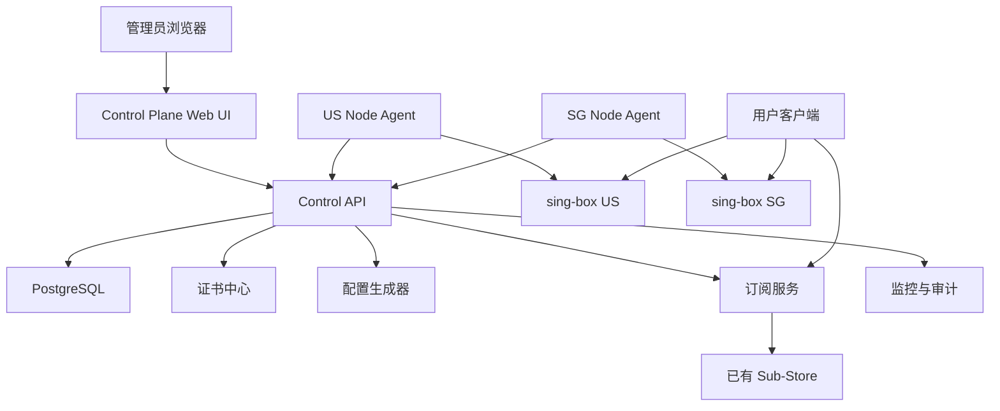

# Distributed S-UI 产品与架构设计

本文档描述基于现有 S-UI 项目重构为分布式 Sing-box 管理平台的第一阶段设计。第一阶段目标是把单机面板升级为 Control Plane + Data Plane 架构，并原生支持 AnyTLS、证书中心、节点 Agent、配置版本管理和 Sub-Store 集成。

## 1. 产品定位

Distributed S-UI 是一个面向个人、小团队和轻量节点运营场景的分布式 Sing-box 管理平台。

目标体验：

- 像 S-UI / X-UI 一样可视化管理节点和用户
- 像 V2Board 一样有用户订阅和流量管理
- 支持分布式节点
- 支持节点自动同步
- 支持节点健康检查
- 支持配置版本管理
- 支持 AnyTLS 和证书自动化
- 集成已有 Sub-Store，而不是重写 Sub-Store

第一阶段不做：

- 支付系统
- 复杂多租户 SaaS
- Kubernetes 强依赖
- 内置重写 Sub-Store

## 2. 目标部署

### 2.1 Control Plane

服务器 A，4GB 内存。

部署：

- s-ui-control
- PostgreSQL
- Web UI
- Agent API
- Subscription API
- Certificate Center
- Sub-Store 外部集成配置

职责：

- 管理用户
- 管理节点
- 管理证书
- 生成配置
- 生成订阅
- 接收节点状态
- 配置版本管理
- 配置下发
- 审计日志

### 2.2 Data Plane

服务器 B/C，AWS 512MB。

部署：

- s-ui-agent
- sing-box

职责：

- 运行 sing-box
- 拉取配置
- 接收证书
- 应用配置
- 失败回滚
- 状态上报
- 流量上报

## 3. 总体架构



关键原则：

- Control Plane 是唯一配置来源
- Agent 主动连接 Control Plane
- Agent 不开放公网管理端口
- 业务流量不经过 Control Plane
- 证书和配置一起版本化
- 节点离线时继续使用最后一次成功配置

## 4. 域名与证书业务逻辑

用户可以使用通配符证书。

示例：

```text
主域名：example.com
证书：*.example.com

US 节点：us.example.com
SG 节点：sg.example.com
```

业务模型：

- 节点保存公开域名
- 证书中心保存证书资产
- 入站配置引用节点域名和证书
- 订阅生成使用节点公开域名
- sing-box 服务端使用 Agent 下发后的本地证书路径

节点示例：

```text
节点：US-01
地区：United States
公网域名：us.example.com
业务端口：443
证书：*.example.com
```

AnyTLS 服务端配置中，域名主要体现在 TLS 配置和证书匹配上；客户端订阅中，域名体现在 `server` 和 `tls.server_name` 上。

服务端示例：

```json
{
  "type": "anytls",
  "tag": "anytls-us-01-443",
  "listen": "::",
  "listen_port": 443,
  "users": [
    {
      "name": "alice",
      "password": "generated-password"
    }
  ],
  "padding_scheme": [],
  "tls": {
    "enabled": true,
    "server_name": "us.example.com",
    "certificate_path": "/usr/local/s-ui-agent/certs/wildcard-example-com/fullchain.pem",
    "key_path": "/usr/local/s-ui-agent/certs/wildcard-example-com/privkey.pem"
  }
}
```

客户端示例：

```json
{
  "type": "anytls",
  "tag": "US-01",
  "server": "us.example.com",
  "server_port": 443,
  "password": "generated-password",
  "tls": {
    "enabled": true,
    "server_name": "us.example.com"
  }
}
```

## 5. 证书中心

证书中心提供统一证书资产管理。

### 5.1 证书来源

支持：

- Panel 内置 ACME DNS-01
- acme.sh 目录导入
- acme.sh deploy hook
- 手动上传 `fullchain.pem` + `privkey.pem`

推荐默认：

- ACME DNS-01
- 支持 wildcard
- 不占用 80/443 端口
- 不和 AnyTLS 业务端口冲突

### 5.2 证书同步

证书不单独裸复制，而是进入配置版本。

流程：

```text
证书签发/续期
→ 生成 certificate_version
→ 找到引用证书的节点
→ 生成 config_version
→ Agent 拉取 config bundle
→ 写入 pending cert
→ 写入 pending config
→ sing-box check
→ apply
→ 上报成功或回滚
```

### 5.3 私钥安全

要求：

- Preview 0.1 当前先完成链路验证，管理员登录密码已改为 bcrypt 哈希存储；DNS Provider 凭据、证书 PEM/私钥已使用 `SUI_SECRET_KEY` 字段级加密
- 稳定版应继续完善密钥轮换、外部 Secret 管理和备份加密策略
- 稳定版应继续完善主密钥轮换和外部 Secret 管理方案
- Agent 只能拉取自己节点需要的证书
- 传输必须走 HTTPS
- Agent 落盘权限 `0600`
- 后续可升级为节点公钥加密私钥包

## 6. Agent 设计

Agent 是单独服务，不嵌入 sing-box。

运行方式：

```text
/usr/local/s-ui-agent/s-ui-agent
systemd: s-ui-agent.service
```

Agent 目录：

```text
/usr/local/s-ui-agent/
├── agent.yaml
├── state.json
├── configs/
│   ├── current.json
│   ├── pending.json
│   └── backup.json
├── certs/
└── logs/
```

职责：

- 节点注册
- 心跳上报
- 拉取配置
- 拉取证书
- 本地校验配置
- 应用配置
- 失败回滚
- sing-box 进程状态检查
- 流量统计上报

Agent 不需要开放端口。

通信方向：

```text
AWS Node Agent → Control Plane API
```

## 7. 节点通信协议

MVP 使用 HTTPS REST + 短轮询。

接口：

| 方法 | 路径 | 用途 |
|---|---|---|
| `POST` | `/api/agent/register` | 节点注册 |
| `POST` | `/api/agent/heartbeat` | 心跳 |
| `GET` | `/api/agent/config/desired` | 获取期望配置 |
| `POST` | `/api/agent/config/report` | 上报配置应用结果 |
| `POST` | `/api/agent/metrics` | 上报资源指标 |
| `POST` | `/api/agent/traffic` | 上报流量 |
| `POST` | `/api/agent/events` | 上报事件 |

认证：

- 初始注册 token
- 注册后发放 agent token
- 请求携带 node id、agent id、时间戳、签名
- 后续支持 mTLS

## 8. 配置同步机制

配置采用 desired state 模型。

流程：

```text
管理员修改配置
→ Control Plane 生成 draft
→ 结构校验
→ 发布 config_version
→ Agent 心跳发现版本落后
→ 拉取 config bundle
→ 写入 pending 文件
→ sing-box check
→ reload/restart
→ 上报状态
→ 失败自动回滚
```

状态：

- draft
- published
- pending
- pulled
- validated
- applied
- healthy
- failed
- rolled_back

config bundle 内容：

```json
{
  "version": 18,
  "node_id": "us-01",
  "config_sha256": "...",
  "certificates": [
    {
      "id": "wildcard-example-com",
      "fingerprint": "...",
      "fullchain_pem": "...",
      "privkey_pem": "..."
    }
  ],
  "singbox_config": {}
}
```

## 9. 数据库设计

第一阶段使用 PostgreSQL。

核心表：

| 表 | 用途 |
|---|---|
| `admins` | 管理员 |
| `users` | 代理用户 |
| `user_quotas` | 流量、过期、限速 |
| `nodes` | 节点 |
| `node_agents` | Agent 注册信息 |
| `node_groups` | 节点分组 |
| `dns_providers` | DNS API 配置 |
| `certificates` | 证书资产 |
| `certificate_versions` | 证书版本 |
| `tls_profiles` | TLS 配置模板 |
| `protocol_templates` | 协议模板 |
| `inbounds` | 入站配置 |
| `inbound_users` | 入站用户映射 |
| `config_versions` | 配置版本 |
| `config_deployments` | 下发记录 |
| `node_heartbeats` | 节点心跳 |
| `node_metrics` | 节点资源 |
| `traffic_stats` | 流量统计 |
| `subscriptions` | 用户订阅 |
| `substore_integrations` | Sub-Store 集成 |
| `audit_logs` | 审计日志 |

关键字段：

`nodes`

- id
- name
- code
- region
- public_host
- public_ip
- enabled
- agent_status
- singbox_status
- last_seen_at

`certificates`

- id
- name
- source
- domains
- wildcard
- active_version_id
- auto_renew
- dns_provider_id

`certificate_versions`

- id
- certificate_id
- fingerprint
- fullchain_pem_encrypted
- private_key_pem_encrypted
- not_before
- not_after
- created_at

`inbounds`

- id
- node_id
- protocol
- public_host
- listen
- listen_port
- template_id
- tls_profile_id
- certificate_id
- form_values_json
- advanced_overrides_json
- rendered_config_json

`config_versions`

- id
- version
- scope
- node_id
- content_json
- sha256
- status
- created_by
- created_at

## 10. 后台页面

保持现有视觉风格，只扩展页面。

新增导航：

- 总览
- 用户
- 节点
- 入站
- 证书中心
- 配置版本
- 订阅
- Sub-Store
- 监控
- 系统设置
- 审计日志

### 10.1 节点页面

列表字段：

- 节点名
- 地区
- 公网域名
- IP
- Agent 状态
- sing-box 状态
- 配置版本
- 最近心跳
- 流量

详情页：

- Agent 安装命令
- 节点事件
- 配置下发记录
- 证书同步状态
- 资源曲线

### 10.2 证书中心

功能：

- 申请证书
- 导入 acme.sh 证书
- 手动上传证书（Preview 0.1 暂不作为主路径）
- 查看过期时间
- 绑定节点/入站
- 自动续期
- 下发状态

证书申请表单：

- 证书名称
- 域名
- 是否 wildcard
- ACME CA
- DNS Provider
- API 凭据
- 自动续期

证书中心 UI 后续需要采用“申请方式切换”：

- `ACME DNS-01`：显示 ACME CA、DNS Provider、DNS API 凭据、自动续期。
- `acme.sh 导入`：显示 acme.sh 证书路径、deploy hook、导入检查。
- `手动上传`：仅作为后续迁移/调试能力；Preview 0.1 不在主界面开放。

不要让 DNS Provider 和 acme.sh/manual 上传同时出现在同一主流程中，避免用户误以为两者都必须配置。

### 10.3 AnyTLS 入站页面

表单分三层：

1. 基础字段
2. 模板选择
3. 高级 JSON 编辑器

基础字段：

- 节点
- 公开域名
- 监听地址
- 监听端口
- 证书
- SNI
- 用户
- padding scheme 模板

保存前：

- 生成 rendered config
- 展示 diff
- 创建 config version
- Agent 本地 `sing-box check`

### 10.4 订阅页面

一个用户一个订阅 token。

初期输出：

- raw URI
- sing-box JSON
- Sub-Store source

当前后端已新增分布式格式：

```text
{subPath}/{token}?format=distributed-json
{subPath}/{token}?format=distributed-source
```

其他客户端格式交给已有 Sub-Store。

示例：

```text
https://panel.example.com/sub/{token}?format=raw
https://panel.example.com/sub/{token}?format=sing-box
https://panel.example.com/sub/{token}?format=sub-store-source
```

## 11. 本地开发

本地用 Docker Compose，不污染 Mac。

服务：

- postgres
- s-ui-control
- fake-agent-us
- fake-agent-sg

清理：

```sh
docker compose down -v
```

Mac 是 ARM，服务器是 x86-64。

构建策略：

- 本地开发：`linux/arm64`
- 发布镜像：`linux/amd64,linux/arm64`
- 服务器拉取：`linux/amd64`

## 12. 第一阶段里程碑

M1：基础设施

- PostgreSQL 接入
- 新增分布式数据模型
- 本地 Docker Compose 开发环境

M2：证书中心

- 证书数据模型
- 手动上传
- acme.sh 导入
- ACME DNS-01 Provider 抽象
- wildcard 证书支持

M3：Agent

- Agent 注册
- 心跳
- 配置拉取
- 证书下发
- sing-box check/apply/rollback
- 安装脚本

当前 Agent API 草案见 `docs/AGENT_API.md`。

当前测试清单见 `docs/TEST_PLAN.md`。

M4：AnyTLS

- AnyTLS 模板与渲染器
- 节点域名绑定
- 证书绑定
- 用户密码生成
- 服务端配置生成
- 客户端订阅生成

M5：管理后台

- 节点页面
- 证书中心页面
- 配置版本页面
- AnyTLS 入站增强
- 订阅页面增强

M6：部署

- 多架构 Docker 镜像
- 4GB 服务器 Control Plane 部署
- AWS 节点 Agent 部署
- Sub-Store 集成验证

## 13. 风险

| 风险 | 说明 | 处理 |
|---|---|---|
| 512MB 节点资源紧张 | 不能跑完整面板 | Agent 必须轻量 |
| 证书私钥泄露 | wildcard 泄露影响所有节点 | 后续支持每节点证书和节点公钥加密 |
| 配置下发失败 | 节点可能断流 | 必须 check + rollback |
| ACME Provider 差异 | DNS API 字段不同 | Provider adapter |
| Sub-Store 不稳定 | 影响部分客户端格式 | Panel 保留 raw/sing-box 输出 |
| 前端依赖版本漂移 | package 与 lock 不一致 | 开发前做 npm install/build 核对 |
