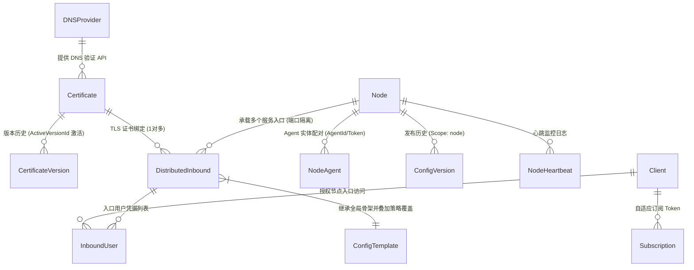

# S-UI Distributed 实体关系与级联变更速查表 (Cheat Sheet)

> **文档定位**：AI 编码助手与后端核心开发者的**第一参考基准**。
> 无论何时修改任何数据结构、服务逻辑、定时任务或 API，必须查阅本速查表，确保**级联变更链（Cascade Chain）**完整闭环，严禁发生“改了上游数据却未触发下游推送”的断层 Bug。

---

## 1. 核心实体 ER 关系图谱



---

## 2. 五大实体级联影响矩阵 (Cascade Impact Matrix)

### ① 证书模块 (Certificate & Acme)
* **核心表**：`certificates`, `certificate_versions`, `dns_providers`
* **主责服务**：`backend/service/certificate.go`, `backend/service/certificate_issue.go`, `backend/cronjob/certRenewJob.go`
* **级联受影响下游**：
  ```text
  [证书更新/续签成功] (ActiveVersionId 变更)
         │
         ├──> 1. DistributedInbound (服务入口表)
         │       必须重新执行: RenderDistributedInbound(inbound.Id)
         │       更新原因: 刷新 RenderedConfigJson 中写入的证书物理路径 (包含新指纹 Fingerprint)
         │
         ├──> 2. Node (集群节点表)
         │       必须重新执行: CalculateNodeDraftSha256(nodeId)
         │       更新原因: 入口配置变动导致草稿配置哈希 (draftSha256) 产生差异
         │
         ├──> 3. ConfigVersion (配置发布版本)
         │       必须执行: PublishNodeConfigVersion(nodeId, "cert-renew-auto")
         │       更新原因: 生成新的版本号 (maxVersion + 1)，标记状态为 published
         │
         ├──> 4. NodeAgent (远端节点代理)
         │       心跳自动感知: desired.ConfigVersion.ID != state.LastReportedConfigID
         │       动作: 下载新证书 PEM 文件并存入对应指纹目录，覆盖 current.json
         │
         └──> 5. Sing-box (代理内核)
                 动作: 触发 SUI_AGENT_RELOAD_COMMAND 重载配置与新证书
  ```
* ⚠️ **历史血泪避坑点**：只更新 `certificates.active_version_id` **绝不等于**节点更新！必须一路级联调用至 `PublishNodeConfigVersion` 才能真正下发给 sing-box。

---

### ② 节点与服务入口模块 (Node & DistributedInbound)
* **核心表**：`nodes`, `distributed_inbounds`, `protocol_templates`
* **主责服务**：`backend/service/distributed_inbound.go`, `backend/service/config_bundle.go`
* **级联受影响下游**：
  ```text
  [服务入口增删改 / 协议高级 JSON 调整 / 策略覆盖]
         │
         ├──> 1. 清除旧缓存: inbound.RenderedConfigJson = nil
         ├──> 2. 计算草稿哈希: CalculateNodeDraftSha256(inbound.NodeId)
         │       面板表现: 节点状态显示为“配置待下发” (draftSha256 != publishedSha256)
         └──> 3. 用户或系统触发发布: PublishNodeConfigVersion(nodeId, actor)
                 ├──> 生成全新 ConfigVersion
                 ├──> 标记 publishedSha256 = draftSha256
                 └──> Agent 心跳拉取并下发
  ```

---

### ③ 用户与授权模块 (Client & InboundUser)
* **核心表**：`clients`, `inbound_users`, `subscriptions`
* **主责服务**：`backend/service/client.go`, `backend/sub/subHandler.go`, `backend/sub/distributedService.go`
* **级联受影响下游**：
  ```text
  [用户状态变动 (禁用/删除/修改密码/修改流量限额)]
         │
         ├──> 1. 节点端配置级联:
         │       所有包含该用户的 Inbound 必须清空 RenderedConfigJson 并重新渲染
         │       受影响的 Node 必须触发重新发布，Agent 重启 sing-box 踢出被禁用户
         │
         ├──> 2. 订阅服务 (Sub Service) 级联:
         │       subHandler 收到用户请求时：
         │       - 若 client.enable == false，立刻返回 400 拦截
         │       - 若已超额流量/到期，动态生成包含限流/停用信息的订阅内容
         │
         └──> 3. 流量计量表 (Stats) 级联:
                 Node 上报流量增量 -> StatsService.SaveStats -> 事务累加 client.up / client.down
  ```

---

### ④ 全局模板与策略层 (Config Template & Policies)
* **核心表**：`settings` (全局模板 key: `node_template_*`)
* **主责服务**：`backend/service/config_template.go`
* **级联受影响下游**：
  * 全局模板决定了所有节点的基础骨架：`dns`, `outbounds`, `route`, `log`, `experimental.v2ray_api`。
  * **修改全局模板时**：所有存量节点的草稿哈希全部变动（`draftSha256` 变脏），需重新发布才能在节点端落地生效。

---

### ⑤ 流量监控与心跳回传层 (Telemetry & Stats)
* **通信协议**：`POST /app/agent/heartbeat`
* **数据流转**：
  ```text
  [sing-box 本地 127.0.0.1:10080 (v2ray_api)]
         │
         ├──> [s-ui-agent] 每 30 秒查询用户流量增量
         │
         └──> [HTTP POST /app/agent/heartbeat] 发送给 Control Plane
                 │
                 ├──> 更新 node.agent_status / node.singbox_status
                 ├──> 更新 node.applied_sha256 (节点实际运行版本)
                 └──> 调用 StatsService.SaveStats (数据库事务累加用户上传/下载总量)
  ```

---

## 3. CodeGraph 函数调用拓扑图 (Call Graph & Impact Topology)

通过 CodeGraph 静态分析提取的核心链路调用关系与波及影响面：

### 链路 A：证书续签到节点下发调用链
```text
[Cron: CertRenewJob.Run]  or  [Web API: issueCertificate]
         │
         ├──> CertificateService.IssueCertificate (backend/service/certificate_issue.go)
         │       └──> runner(acme.sh --issue & --install-cert)
         │       └──> SaveCertificateVersion(version) (backend/service/certificate.go)
         │               └──> db.Save(version)
         │               └──> certificate.ActiveVersionId = version.Id
         │
         └──> 【必须触发的级联下发】: CascadeUpdateCertificate(certId)
                 │
                 ├──> 遍历相关 DistributedInbound:
                 │       └──> RenderDistributedInbound(inboundId)
                 │               └──> AnyTLSCertificatePaths (生成新指纹路径)
                 │               └──> RenderDistributedAnyTLSInbound
                 │               └──> db.Save(inbound.RenderedConfigJson)
                 │
                 └──> 遍历受影响的 Nodes:
                         └──> PublishNodeConfigVersion(nodeId, "auto-renew")
                                 └──> renderNodeConfigJson(nodeId)
                                 └──> 创建全新 ConfigVersion (status: "published")
                                 └──> node.PublishedSha256 = sha256Hex
```

### 链路 B：Agent 心跳拉取与内核热重载调用链
```text
[Agent: main.go Ticker] (3s ~ 30s)
         │
         ├──> heartbeat (上报 singboxStatus, 版本, 流量统计 stats)
         │       └──> POST /app/agent/heartbeat -> AgentService.Heartbeat -> StatsService.SaveStats
         │
         └──> getDesiredConfig (GET /app/agent/config/desired)
                 └──> AgentService.GetDesiredConfig
                         ├──> 查出最新 published 的 ConfigVersion
                         └──> getDesiredCertificates (读取 ActiveVersionId 的 fullchain/privkey)
                 │
                 [Agent 判定]: desired.ConfigVersion.ID != state.LastReportedConfigID
                 │
                 ├──> reportConfig("pulled")
                 ├──> stageDesiredBundle
                 │       ├──> writeCertificates (写入 /usr/local/s-ui-agent/certs/<domain>-<fingerprint>/)
                 │       └──> stageDesiredConfig (写入 configs/current.json)
                 ├──> runReloadCommand ("systemctl reload sing-box" or "docker restart sing-box")
                 ├──> reportConfig("applied")
                 └──> saveState (更新 state.LastReportedConfigID = desired.ConfigVersion.ID)
```

---

## 4. 核心接口与函数速查

| 操作意图 | 调用函数 / API | 文件位置 | 备注 |
| :--- | :--- | :--- | :--- |
| **证书级联自动下发** | `CascadeUpdateCertificate(certId)` | `backend/service/certificate.go` | **核心必接**：连通证书与节点发布的纽带 |
| **渲染单入口配置** | `RenderDistributedInbound(inboundId)` | `backend/service/distributed_inbound.go` | 更新 `inbound.RenderedConfigJson` |
| **重新发布节点配置** | `PublishNodeConfigVersion(nodeId, actor)` | `backend/service/config_bundle.go` | 生成新 `ConfigVersion`，更新 `publishedSha256` |
| **更新草稿哈希** | `CalculateNodeDraftSha256(nodeId)` | `backend/service/config_bundle.go` | 比较 draft 与 published 判断是否需要下发 |
| **签发/续签证书** | `IssueCertificate(certId)` | `backend/service/certificate_issue.go` | 调用 acme.sh，生成新 `CertificateVersion` |
| **获取节点待生效配置**| `GetDesiredConfig(agentId, agentToken)` | `backend/service/agent.go` | Agent 拉取入口，携带配置与证书 Bundle |
| **用户流量归集** | `SaveStats(stats)` | `backend/service/stats.go` | 事务原子累加 `Client.up` 和 `Client.down` |
